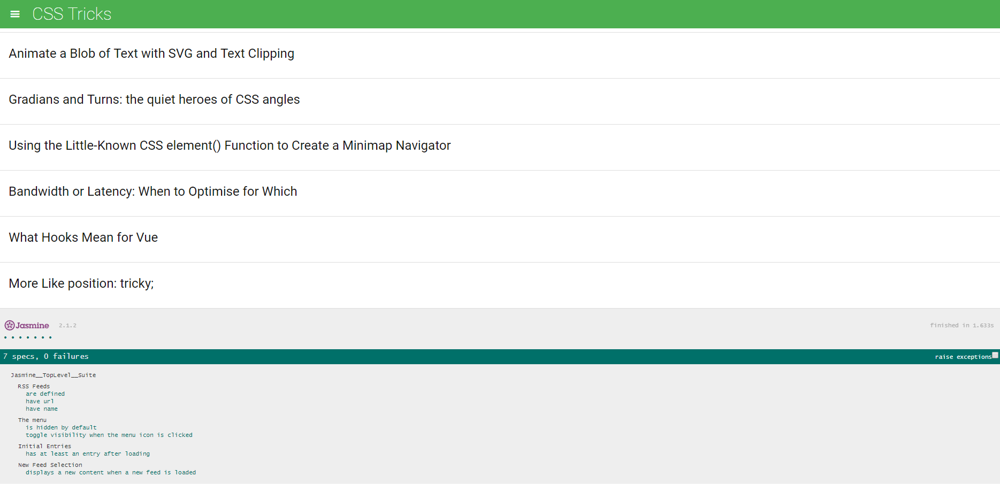

# Udacity FrontEnd Nanodegree - Feed Reader Testing

This is part of the Udacity's [FrontEnd developper Nanodegree](https://www.udacity.com/course/front-end-web-developer-nanodegree--nd001).

The goal of this project was to wrote a serie of tests with the [Jasmine Framework](https://jasmine.github.io/).

---
### How to run ?

1. Clone this repo: `$ git clone https://github.com/MattLdwig/FEND-Nanodegree-Jasmine-Testing.git`
2. Navigate to the folder: `cd FEND-Nanodegree-Jasmine-Testing`
2. Open `index.html`

